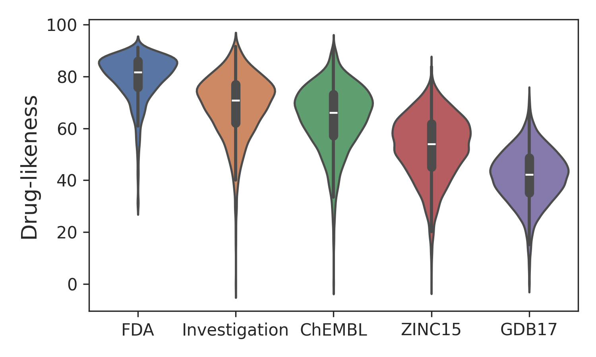

# Drug-likeness scoring based on unsupervised learning



This repository contains API for [Drug-likeness scoring based on unsupervised learning](https://pubs.rsc.org/en/content/articlehtml/2022/sc/d1sc05248a).
Original code is available at [SeonghwanSeo/DeepDL](https://github.com/SeonghwanSeo/DeepDL).

If you want to train the model with your own dataset, please see the section [#train-model](#train-model).

If you have any problems or need help with the code, please add an issue or contact <shwan0106@kaist.ac.kr>.

### TL;DR

```bash
# evaluate a molecule with DeepDL
>>> python scoring.py 'CC(=O)Oc1ccccc1C(=O)O'
score: 88.856

# evaluate a molecule with naive setting using another model
>>> python scoring.py 'CC12C(O)CNC13C1CC(N1)C23' --naive -m chemsci-2021
score: 41.399

# screening
>>> python screening.py data/examples/chembl_1k.smi -o out.csv --naive --cuda
```

- `88.856` is the predicted score. The higher the score, the higher the **drug-likeness**.
- For fast screening, consider using `naive` setting, which evaluates a single stereoisomer.
- Multiple models are providen; see [#model-list](#model-list) for details.

## Installation

```bash
# use pip
pip install druglikeness

# from official github (python 3.9-3.13)
git clone https://github.com/SeonghwanSeo/drug-likeness.git
cd drug-likeness
pip install -e .
```

## Python API

```python
from druglikeness.deepdl import DeepDL

# Enter the name of model (see `# Model List`) or the path of your own model.
pretrained_model_name_or_path = "extended"

# This will download the model weights if you provide the model name.
model = DeepDL.from_pretrained(pretrained_model_name_or_path, device="cpu")

# Evaluate the molecule.
score = model.scoring(smiles="CC(=O)Oc1ccccc1C(=O)O", naive=False)

# Screen the molecules.
score_list = model.screening(smiles_list=["c1ccccc1", "CCN"], naive=True, batch_size=64)
```

## Model List

| Model Name              | Description                                                                                 |
| :---------------------- | :------------------------------------------------------------------------------------------ |
| `extended` (default)              | **New model** trained on an updated drug database. (excluding test set: FDA-approved drugs) |
| `chemsci-2025`          | **Retrained model** of `chemsci-2021` with hyperparameter tuning.                |
| `chemsci-2021`          | **Finetuned model** from the paper (PubChem pretrained, World Drug finetuned).              |
| `chemsci-2021-pretrain` | **Pretrained model** from the paper (trained on PubChem)                                    |

If your environment is offline, you can manually download the models from [Google Drive](https://drive.google.com/drive/folders/1yMxR7HwmwH8wK1mA3wgEasOZ510Ib1-o?usp=share_link).

### Model Performance

Following shows the scoring performance (AUROC) of the models on the various test datasets.

| Model          | Mode   | FDA vs ChEMBL | FDA vs ZINC15 | FDA vs GDB17 |
| -------------- | ------ | ------------- | ------------- | ------------ |
| `extended`     | strict | 0.862         | 0.961         | 0.991        |
| `extended`     | naive  | 0.861         | 0.961         | 0.989        |
| `chemsci-2025` | strict | 0.817         | 0.941         | 0.984        |
| `chemsci-2025` | naive  | 0.817         | 0.941         | 0.982        |

## Train Model

You can finetune the model with your own dataset using the pretrained model on **PubChem** dataset.

```bash
pip install -e '.[train]'

# train with the 2.8k training set from the paper
bash ./scripts/download_data.sh
python ./scripts/train_deepdl.py --data_path ./data/train/worlddrug_not_fda.smi

python ./scripts/train_deepdl.py --data_path <smi_file>
```

Train DeepDL2 with a YAML config in `configs/deepdl2/`. Set `train_data` to a Hugging Face
`save_to_disk` dataset containing a `smiles` string column and `save_dir` to the
output directory. DataLoader workers tokenize SMILES when assembling each batch.
The supplied configs
use `???` for dataset and pretrained checkpoint paths for the user to fill in. By default, all
visible GPUs are used; `devices: N` in YAML selects a GPU count. Lightning launches
distributed training automatically.

For PubChem continuation, set `init_checkpoint` to a ZINC Lightning `.ckpt` file.
The PubChem configs use `init_optimizer: true` to carry over Adam moments and its
step counter, while starting a new epoch counter and LR schedule from the YAML
settings (`warmup_steps: 0`). Set `init_optimizer: false` for weights-only loading.
`resume_checkpoint` takes precedence and restores the full interrupted training
state instead. Exported `model.pt` files contain no optimizer state.

```bash
pip install -e '.[train,deepdl2]'
python scripts/train_deepdl2.py configs/deepdl2/medium_stage1_zinc20.yaml

# Continue with PubChem after preparing its HF dataset and completing stage 1.
python scripts/train_deepdl2.py configs/deepdl2/medium_stage2_pubchem.yaml

# Resume an interrupted stage, including optimizer and scheduler state.
python scripts/train_deepdl2.py configs/deepdl2/medium_stage1_zinc20.yaml \
    --resume_checkpoint result/deepdl2/medium_stage1_zinc20/checkpoints/last.ckpt
```

`batch_size` is per GPU. Gradient accumulation is computed as
`global_batch_size // (batch_size * devices)`, following esm-open. Choose a global
batch that is a positive integer multiple of `batch_size * devices`.
Global batch counts molecules, not tokens; `max_length` excludes BOS/EOS.
Both training and validation keep the first `max_length` lexical tokens, append
EOS, and pad to `max_length + 1`. The model inserts BOS internally. Overlength
molecules are truncated rather than dropped, and both loaders use `drop_last=True`.
The CLI does not probe GPU memory or tune the per-GPU batch size.
Defaults include the medium model, BF16 mixed precision, compile mode `default`,
LR `3e-4`, and logging every 100 optimizer steps. The resolved training
configuration is saved to `save_dir/config.json`.

Configs are named `<size>_stage<number>_<dataset>.yaml` for small, medium, large and xlarge.
The large preset uses hidden size 512, 8 layers and 8 attention heads (25,784,320 parameters).
The xlarge preset uses hidden size 512, 12 layers and 8 attention heads (38,633,984 parameters).
Stage 1 uses ZINC20 with a 127-token limit. Stage 2 initializes from stage 1 model
weights, starts a new optimizer/schedule, and uses PubChem with a 255-token limit.
PubChem configs are templates: prepare a SMILES HF dataset before running;
their LR, batch size and epoch count have not been tuned. Relative paths resolve from the
working directory; run these commands from the repository root. Update dataset
and checkpoint paths for another machine or existing training run.

Use compressed Parquet for storage/transfer and a local HF Arrow dataset for
training. Both contain full SMILES strings, without tokenization or length
filtering. SMI conversion canonicalizes by default; use `--no_canonical` for
already canonicalized input. Canonicalization is an offline step; the DataLoader
only tokenizes, truncates and pads.

```bash
# Custom whitespace-delimited SMI or SMI.ZST files; SMILES is the first column.
python scripts/smi_to_parquet.py data/*.smi.zst \
    --output data/train-parquet --no_canonical

# On the training node: decompress into a load_from_disk-compatible dataset.
python scripts/parquet_to_arrow.py data/train-parquet \
    --output /scratch/train-arrow --num_proc 8
```

Parquet uses Zstd level 5 by default (`--compression_level` changes it), a single
`smiles` UTF-8 string column and 100,000-row groups. SMI conversion creates a new
output directory containing `shard-00000.parquet`, etc., combining inputs in order.
Small datasets produce one file; larger datasets roll over at approximately
500 MB compressed (`--max_shard_size_mb` changes the target). A shard may exceed
the target by a row group and file metadata. Molecules with atom-mapping
annotations are excluded. Custom conversion does not shuffle or deduplicate.
Arrow conversion streams Parquet row groups directly into final HF Arrow files,
without an intermediate Arrow cache or a second full dataset copy. It preserves
input order and divides rows evenly between shards. The default shard count is
estimated from Parquet's uncompressed SMILES size at approximately 500 MB per shard;
`--num_shards` selects a fixed count. Metadata scanning and shard completion display
progress bars. `--output` must be a new directory; an interrupted conversion can
leave partial output, which must be removed or replaced with a new output path
before restarting. Set the training YAML's `train_data` to the resulting Arrow
directory, readable with `datasets.load_from_disk`.

For ZINC20, allow approximately 127 GB for the downloaded Parquet plus final Arrow,
in addition to the Python environment and other files. Any temporary Arrow caches
left by an older conversion must be cleaned up separately.

Existing datasets containing only `token_ids` must be replaced with SMILES datasets
before launching a new run with this code.

## Evaluation

```bash
# download train/test datasets
>>> bash ./scripts/download_data.sh

# evaluate the model
>>> python ./scripts/evaluate.py --cuda

# Output
Test 1489 molecules in data/test/fda.smi
Average score: 79.40051813170444

Test 1792 molecules in data/test/investigation.smi
Average score: 68.71052120625973

Test 10000 molecules in data/test/chembl.smi
Average score: 64.11581128692627

Test 10000 molecules in data/test/zinc15.smi
Average score: 52.7382759815216

Test 10000 molecules in data/test/gdb17.smi
Average score: 39.37572152862549

AUROC
FDA vs Investigation   : 0.789
FDA vs ChEMBL          : 0.862
FDA vs ZINC15          : 0.961
FDA vs GDB17           : 0.991
```

## Citation

```bibtex
@article{lee2022drug,
  title={Drug-likeness scoring based on unsupervised learning},
  author={Lee, Kyunghoon and Jang, Jinho and Seo, Seonghwan and Lim, Jaechang and Kim, Woo Youn},
  journal={Chemical science},
  volume={13},
  number={2},
  pages={554--565},
  year={2022},
  publisher={Royal Society of Chemistry}
}
```
